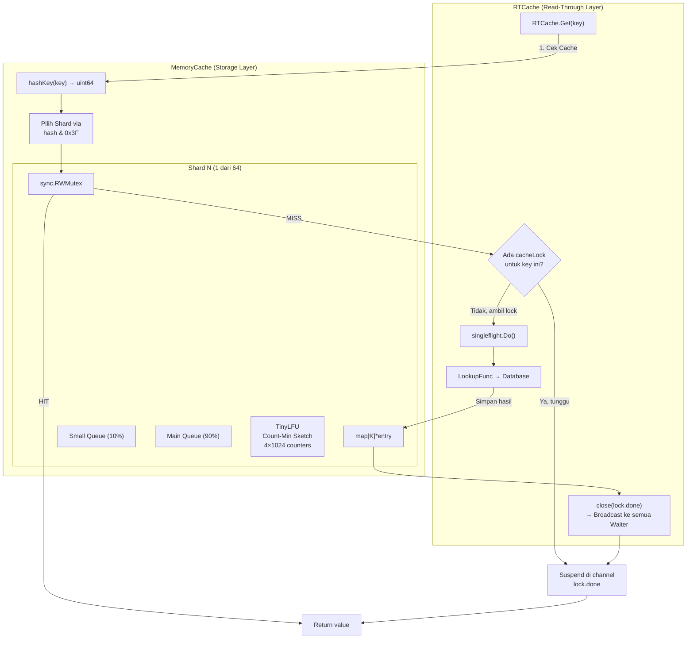
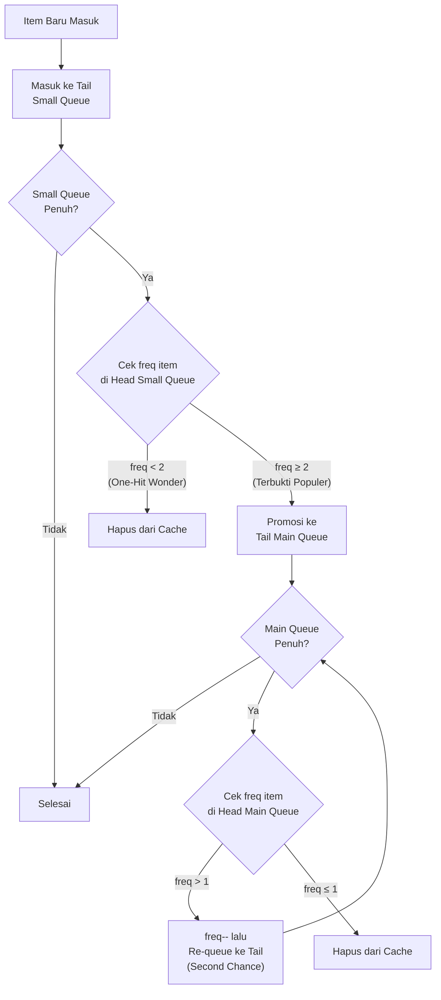
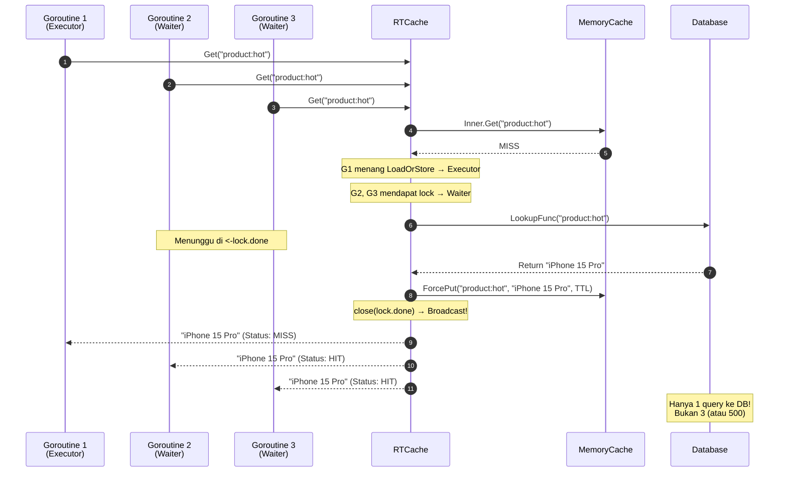
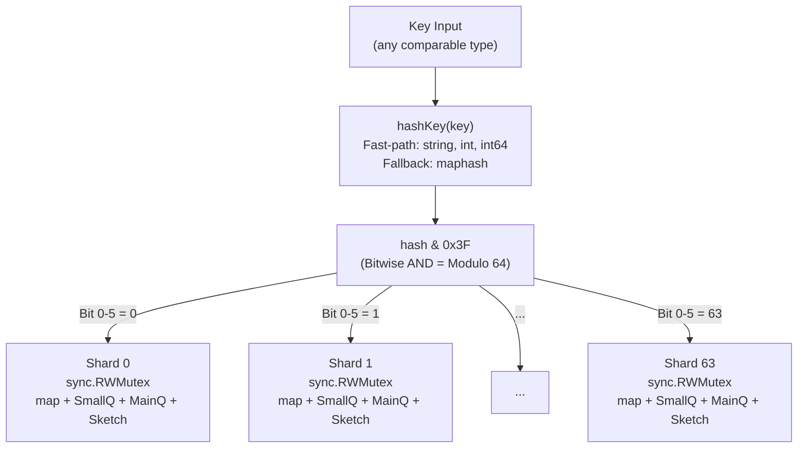
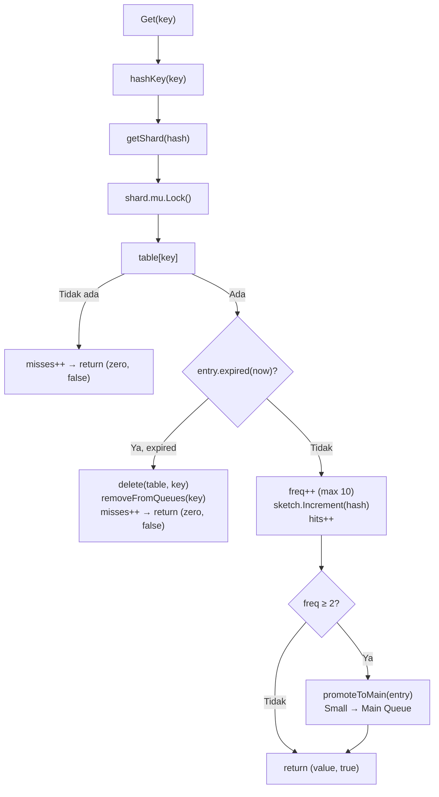
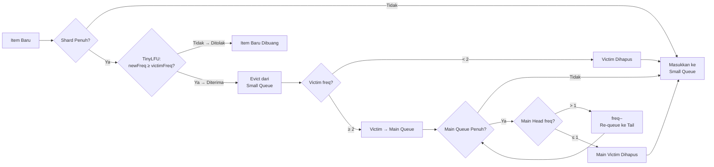

<div align="center">

# go-cache

**High Performance In-Memory & Read-Through Cache for Go**

[](https://pkg.go.dev/github.com/semmidev/go-cache)
[](https://goreportcard.com/report/github.com/semmidev/go-cache)
[](https://go.dev)
[](https://github.com/semmidev/go-cache/tags)
[](https://opensource.org/licenses/MIT)

<p>
  Pustaka <i>in-memory cache</i> performa tinggi untuk Go yang menggabungkan teknik-teknik caching mutakhir: <b>S3-FIFO Eviction</b>, <b>TinyLFU Admission Control</b> via <b>Count-Min Sketch</b>, <b>Lock Striping</b>, dan <b>Read-Through Coalescing</b>.
</p>

```bash
go get github.com/semmidev/go-cache
```

</div>

---

## Daftar Isi

1. [Mengapa go-cache?](#mengapa-go-cache)
2. [Arsitektur Tingkat Tinggi](#arsitektur-tingkat-tinggi)
3. [Deep Dive: S3-FIFO Eviction](#1-deep-dive-s3-fifo-eviction)
4. [Deep Dive: TinyLFU & Count-Min Sketch](#2-deep-dive-tinylfu--count-min-sketch)
5. [Deep Dive: Lock Striping / Sharding](#3-deep-dive-lock-striping--sharding-64-shards)
6. [Deep Dive: Read-Through Cache & Anti-Stampede](#4-deep-dive-read-through-cache--anti-cache-stampede)
7. [Deep Dive: Lock Age & Lock Timeout](#5-deep-dive-lock-age--lock-timeout)
8. [Deep Dive: Context Cancellation Leak (Issue #931)](#6-deep-dive-context-cancellation-leak-fix-issue-931)
9. [Panduan Penggunaan](#panduan-penggunaan)
10. [Pengujian & Benchmark](#pengujian--benchmark)
11. [Referensi Akademis & Industri](#referensi-akademis--industri)

---

## Mengapa go-cache?

### Problem Statement

Setiap aplikasi backend membutuhkan caching. Tapi caching yang *benar* ternyata sangat sulit:

| Problem | Dampak |
|---------|--------|
| **Eviction policy naif (LRU)** | Item populer bisa dibuang hanya karena ada burst traffic sementara |
| **Global mutex** | Seluruh goroutine saling menunggu satu lock → throughput anjlok |
| **Cache Stampede** | 1000 request serentak ke key yang sama → 1000 query ke database |
| **Context cancellation leak** | Satu goroutine yang dibatalkan bisa membuat lock "bocor" → deadlock permanen |
| **Frequency tracking yang boros memori** | Menyimpan counter per-key menghabiskan memori yang seharusnya bisa dipakai untuk data |

**go-cache** menyelesaikan **semua** problem di atas dengan teknik-teknik yang telah terbukti secara akademis dan digunakan di production oleh perusahaan-perusahaan besar.

### Keunggulan Utama

- **S3-FIFO + TinyLFU** — Hit ratio lebih tinggi dari LRU/LFU/ARC dengan overhead mendekati nol
- **64-Shard Lock Striping** — Concurrent read/write tanpa global lock contention
- **Read-Through Coalescing** — 1000 request serentak = 1 database query
- **Zero-Alloc Hot Path** — `Get()` pada cache hit: **0 B/op, 0 allocs/op**
- **Context-Safe** — Tidak ada lock leak walaupun goroutine di-cancel
- **Go Generics** — Type-safe tanpa casting: `cache.New[string, User]()`
- **TTL Native** — Expirasi otomatis per-entry tanpa background goroutine

---

## Arsitektur Tingkat Tinggi

Sebelum masuk ke detail tiap komponen, berikut gambaran besar bagaimana seluruh bagian go-cache saling terhubung:



Ada **dua layer utama**:

1. **MemoryCache** — Layer penyimpanan murni. Menangani hashing, sharding, eviction (S3-FIFO), dan admission control (TinyLFU).
2. **RTCache (Read-Through Cache)** — Layer koordinasi. Menangani request coalescing, singleflight dedup, locking, dan integrasi dengan database/origin.

---

## Teknik & Istilah Utama — Technical Deep Dive

### 1. Deep Dive: S3-FIFO Eviction

#### Sejarah & Latar Belakang

Selama puluhan tahun, **LRU (Least Recently Used)** menjadi algoritma eviction standar de facto di hampir semua sistem cache — dari CPU cache hingga CDN. Prinsipnya sederhana: *"Buang item yang paling lama tidak diakses."*

Namun LRU memiliki kelemahan fundamental:

```
Skenario: Cache kapasitas 3, akses pattern: A B C D A B C D A B C D ...

LRU Cache State:
  [A]       → A masuk
  [B, A]    → B masuk
  [C, B, A] → C masuk, cache penuh
  [D, C, B] → D masuk, A dibuang ← padahal A akan segera diakses lagi!
  [A, D, C] → A masuk, B dibuang ← padahal B akan segera diakses lagi!
  ...dst (miss rate 100%!)
```

Ini disebut **scan resistance problem** — LRU sangat rentan terhadap sequential scan dan burst traffic yang sesaat menggeser item-item populer keluar dari cache.

Pada tahun 2023, peneliti dari Carnegie Mellon University mempublikasikan paper **"FIFO Queues are All You Need for Cache Eviction"** (SOSP '23) yang memperkenalkan **S3-FIFO**. Hasil benchmark menunjukkan bahwa S3-FIFO secara konsisten mengalahkan LRU, CLOCK, ARC, dan 2Q di berbagai workload produksi nyata — dengan implementasi yang **jauh lebih sederhana**.

#### Cara Kerja S3-FIFO di go-cache

S3-FIFO menggunakan **dua antrean FIFO** (bukan linked list seperti LRU, melainkan queue sederhana):

```
┌─────────────────────────────────────────────────────┐
│                   Shard (1 dari 64)                  │
│                                                     │
│  ┌─────────────────────┐  ┌──────────────────────┐  │
│  │  Small Queue (10%)  │  │   Main Queue (90%)   │  │
│  │                     │  │                      │  │
│  │  Menampung item     │  │  Menampung item      │  │
│  │  BARU yang belum    │  │  yang sudah TERBUKTI │  │
│  │  terbukti populer.  │  │  populer (freq ≥ 2). │  │
│  │                     │  │                      │  │
│  │  ┌───┬───┬───┬───┐  │  │  ┌───┬───┬───┬───┐  │  │
│  │  │ D │ C │ B │ A │  │  │  │ Z │ Y │ X │ W │  │  │
│  │  └───┴───┴───┴───┘  │  │  └───┴───┴───┴───┘  │  │
│  │  HEAD→          ←TAIL│  │  HEAD→          ←TAIL│  │
│  └─────────────────────┘  └──────────────────────┘  │
│                                                     │
│  ┌─────────────────────────────────────────────┐    │
│  │           TinyLFU (Count-Min Sketch)        │    │
│  │  Admission filter: menolak item yang        │    │
│  │  estimasi frekuensinya lebih rendah         │    │
│  │  dari victim di Small Queue                 │    │
│  └─────────────────────────────────────────────┘    │
└─────────────────────────────────────────────────────┘
```

#### Alur Lengkap Item dalam S3-FIFO

**Langkah 1 — Insersi**: Item baru **selalu** masuk ke tail Small Queue.

**Langkah 2 — Eviction dari Small Queue** (saat Small Queue penuh):
- Periksa item di **head** Small Queue (item tertua).
- Jika `freq < 2` → item ini *"one-hit wonder"* → **hapus dari cache**. Item ini hanya diakses sekali dan kemungkinan besar tidak akan diakses lagi.
- Jika `freq ≥ 2` → item ini terbukti populer → **promosikan ke Main Queue**.

**Langkah 3 — Eviction dari Main Queue** (saat Main Queue penuh):
- Periksa item di **head** Main Queue.
- Jika `freq > 1` → **kurangi freq**, pindahkan ke **tail** Main Queue (kesempatan kedua / *second chance*).
- Jika `freq ≤ 1` → item ini sudah tidak populer lagi → **hapus dari cache**.



#### Kenapa S3-FIFO Lebih Baik dari LRU?

| Aspek | LRU | S3-FIFO |
|-------|-----|---------|
| **Scan Resistance** | Tidak. Burst scan menggeser item populer keluar | Ya. Small Queue menyaring "one-hit wonders" |
| **Overhead per-akses** | Perlu memindahkan node ke head linked list | Hanya increment counter `freq` (O(1)) |
| **Implementasi** | Doubly-linked list + hash map | Dua slice + hash map (cache-friendly) |
| **Thread-safety** | Lock setiap move-to-front | Lock hanya saat eviction |

---

### 2. Deep Dive: TinyLFU & Count-Min Sketch

#### Problem Statement

Bayangkan cache sudah penuh dan item baru `X` hendak masuk. Pertanyaannya: *siapa yang harus dikorbankan?*

Pendekatan naif adalah selalu menerima item baru (optimistic admission). Tapi bagaimana jika item baru `X` hanya diakses sekali, sedangkan item yang akan dibuang `Y` sebenarnya masih sering diakses? Kita baru saja membuat **cache pollution** — mengisi cache dengan sampah dan membuang item berharga.

**TinyLFU** (Tiny Least Frequently Used) menyelesaikan ini dengan menjadi **penjaga gerbang** (admission filter) yang membandingkan estimasi frekuensi item baru vs item korban.

#### Apa itu Count-Min Sketch?

Count-Min Sketch (CMS) adalah **struktur data probabilistik** yang ditemukan oleh Graham Cormode dan S. Muthukrishnan (2005) untuk mengestimasi frekuensi elemen dalam data stream dengan penggunaan memori yang sangat kecil.

Bayangkan CMS sebagai "tabel kehadiran" di kelas, tapi versi yang sangat ringkas:

```
Bukan seperti ini (exact counting — boros memori):
  {"key-A": 42, "key-B": 7, "key-C": 1389, ... jutaan entry}

Melainkan seperti ini (probabilistic sketch — sangat hemat):
  4 baris × 1024 kolom = 4096 counter saja!
  Cukup untuk mengestimasi frekuensi jutaan key berbeda.
```

#### Implementasi di go-cache

go-cache menggunakan Count-Min Sketch dengan konfigurasi berikut:

| Parameter | Nilai | Penjelasan |
|-----------|-------|------------|
| `sketchRows` | 4 | Jumlah baris (hash functions independen) |
| `sketchWidth` | 1024 | Jumlah kolom per baris (harus power-of-2) |
| `maxCounter` | 15 | Nilai maksimum counter (4-bit, range 0-15) |
| `sketchMask` | 1023 | Bitmask untuk operasi modulo cepat (`hash & 1023`) |

**Cara Kerja `Increment(hash)`:**

Ketika key diakses, hash-nya di-scatter ke 4 posisi independen menggunakan **Knuth Multiplicative Hashing**:

```
Row 0: idx = (hash + 0 × φ) & 1023    →  counter[0][idx]++
Row 1: idx = (hash + 1 × φ) & 1023    →  counter[1][idx]++
Row 2: idx = (hash + 2 × φ) & 1023    →  counter[2][idx]++
Row 3: idx = (hash + 3 × φ) & 1023    →  counter[3][idx]++

dimana φ = 0x9E3779B97F4A7C15 (Golden Ratio × 2⁶⁴)
```

Konstanta `0x9E3779B97F4A7C15` adalah **Golden Ratio Constant** (rasio emas) yang diskala ke ruang 64-bit. Ini bukan angka sembarang — Donald Knuth dalam bukunya *"The Art of Computer Programming"* Vol. 3 membuktikan bahwa perkalian dengan rasio emas menghasilkan distribusi hash yang sangat merata (*minimal clustering*). Dengan mengalikan nomor baris (`r`) dengan konstanta ini, kita mendapatkan 4 posisi yang hampir pasti tidak berkorelasi satu sama lain, meminimalkan collision antar baris.

**Cara Kerja `Estimate(hash)`:**

```
Estimate = min(counter[0][idx0], counter[1][idx1], counter[2][idx2], counter[3][idx3])
```

Mengapa mengambil **minimum**? Karena Count-Min Sketch hanya bisa *overestimate* (tidak pernah underestimate). Collision pada satu baris bisa menaikkan counter secara palsu, tetapi kemungkinan collision terjadi di **semua 4 baris sekaligus** sangat kecil. Mengambil minimum memberikan estimasi paling mendekati kebenaran.

#### Mekanisme Aging (Halving / Decay)

Problem: Pola akses berubah seiring waktu. Item yang populer 1 jam lalu mungkin sudah tidak relevan sekarang. Jika counter terus naik tanpa batas, item-item lama akan terus mendominasi cache karena frekuensi historisnya yang tinggi — ini disebut **stale frequency problem**.

Solusi: **Counter Aging** (halving). Setelah akumulasi `10.240` increment, **seluruh** counter di semua baris dibagi 2:

```
Sebelum aging:  [12, 8, 15, 3, 7, 1, 14, 6, ...]
Sesudah aging:  [ 6, 4,  7, 1, 3, 0,  7, 3, ...]  ← semua dibagi 2

Efeknya: frekuensi historis "meluruh" secara gradual,
         item yang masih aktif akan cepat naik kembali,
         item yang sudah tidak aktif akan perlahan hilang.
```

Threshold `10.240` (`sketchWidth × 10 = 1024 × 10`) dipilih agar aging tidak terjadi terlalu sering (yang akan menghapus informasi frekuensi berharga) atau terlalu jarang (yang membuat sketch tidak responsif terhadap perubahan pola akses).

#### TinyLFU Admission Decision

Ketika cache penuh dan item baru hendak masuk lewat `Put()`:

```go
func shouldAdmit(newItemHash uint64) bool {
    victim := smallQueue[0]  // Kandidat eviction di head Small Queue
    return sketch.Estimate(newItemHash) >= sketch.Estimate(victim.hash)
    //     ^^^^^^^^^^^^^^^^^^^^^^^^         ^^^^^^^^^^^^^^^^^^^^^^
    //     Estimasi frekuensi item baru     Estimasi frekuensi korban
}
```

- Jika item baru **lebih populer** (atau sama) dengan korban → **diterima** (admitted), korban dibuang.
- Jika item baru **kurang populer** → **ditolak** (rejected), item baru dibuang, korban dipertahankan.

> **Catatan**: `ForcePut()` melewati pemeriksaan TinyLFU sepenuhnya. Ini digunakan oleh RTCache untuk menjamin data hasil lookup selalu masuk ke cache.

---

### 3. Deep Dive: Lock Striping / Sharding (64 Shards)

#### Problem Statement

Cache diakses oleh banyak goroutine secara bersamaan. Solusi paling sederhana adalah satu `sync.Mutex` global:

```go
// Naif: Global Lock
type NaiveCache struct {
    mu    sync.Mutex      // Semua goroutine berebut 1 lock ini
    data  map[string]any
}

func (c *NaiveCache) Get(key string) any {
    c.mu.Lock()           // Goroutine 1 lock → Goroutine 2,3,...,N menunggu
    defer c.mu.Unlock()
    return c.data[key]
}
```

Pada mesin 8-core dengan 100 goroutine, **99 goroutine selalu menunggu** saat 1 goroutine sedang membaca/menulis. Ini mengubah program paralel menjadi program serial secara efektif — fenomena yang disebut **lock contention**.

#### Solusi: Lock Striping

Ide dasarnya: **bagi data menjadi N partisi independen, masing-masing dengan lock sendiri**. Goroutine yang mengakses partisi berbeda tidak perlu saling menunggu.

```
┌─────────────────────────────────────────────────────────────────┐
│                        MemoryCache                              │
│                                                                 │
│  hash("user:1") & 0x3F = 5   → Shard[5]  ← Lock A             │
│  hash("user:2") & 0x3F = 12  → Shard[12] ← Lock B             │
│  hash("user:3") & 0x3F = 5   → Shard[5]  ← Lock A (sama)      │
│  hash("user:4") & 0x3F = 47  → Shard[47] ← Lock C             │
│                                                                 │
│  Lock A, B, dan C adalah mutex INDEPENDEN!                      │
│  user:1 dan user:3 saling menunggu (shard sama).                │
│  user:2 dan user:4 TIDAK menunggu siapapun (shard beda).        │
└─────────────────────────────────────────────────────────────────┘
```

#### Kenapa 64 Shard? Kenapa Power-of-Two?

**Jumlah 64** dipilih berdasarkan trade-off:
- **Terlalu sedikit shard** (mis. 4) → masih banyak contention
- **Terlalu banyak shard** (mis. 4096) → pemborosan memori untuk lock + overhead manajemen

64 shard memberikan **probabilitas collision < 2%** pada mesin 8-core dengan 8 goroutine aktif secara simultan (berdasarkan Birthday Paradox: `P(collision) ≈ n²/2s` dimana `n` = goroutine aktif, `s` = jumlah shard).

**Power-of-two** memungkinkan penggantian operasi modulo (mahal) dengan **bitwise AND** (sangat murah):

```go
// Lambat: operasi modulo
shardIndex = hash % 64    // Division instruction (15-30 CPU cycles)

// Cepat: bitwise AND (identik hasilnya karena 64 = 2⁶)
shardIndex = hash & 63    // AND instruction (1 CPU cycle)
//                 ^^
//                 63 = 0x3F = 0b00111111 (bitmask)
```

---

### 4. Deep Dive: Read-Through Cache & Anti-Cache Stampede

#### Problem Statement: Cache Stampede

**Cache Stampede** (juga dikenal sebagai **Thundering Herd** atau **Dog-pile Effect**) adalah salah satu masalah paling berbahaya dalam sistem terdistribusi.

Skenario:

```
Waktu T=0: Key "product:popular" ada di cache, TTL 5 menit
Waktu T=5m: Key expired!

Tepat saat itu, 500 request masuk bersamaan untuk key yang sama:

  Goroutine 1  → Cache MISS → Query DB (SELECT * FROM products WHERE id='popular')
  Goroutine 2  → Cache MISS → Query DB (query yang SAMA!)
  Goroutine 3  → Cache MISS → Query DB (query yang SAMA!)
  ...
  Goroutine 500 → Cache MISS → Query DB (query yang SAMA!)

Hasil: 500 query identik ke database secara serentak!
       → Database overload → Timeout → Cascading failure
```

Inilah yang menyebabkan banyak insiden downtime di perusahaan-perusahaan besar. Satu key populer yang expire bisa menjatuhkan seluruh database cluster.

#### Solusi: Request Coalescing (Penggabungan Request)

go-cache menggunakan **tiga lapis pertahanan** terhadap cache stampede:

**Lapis 1: `sync.Map` Lockers (Per-Key Coordination)**

Setiap key yang sedang dalam proses lookup mendapatkan sebuah `cacheLock` — struktur yang berisi channel `done` dan timestamp `start`.

```go
type cacheLock struct {
    start time.Time       // Kapan lock ini dibuat
    done  chan struct{}    // Channel untuk broadcast "selesai"
}
```

Goroutine pertama yang meminta key mendapat peran **Executor** (yang benar-benar query ke database). Goroutine berikutnya mendapat peran **Waiter** (yang menunggu sinyal dari Executor).

**Lapis 2: `singleflight.Group` (Deduplication)**

Bahkan jika dua goroutine berhasil melewati `sync.Map` secara bersamaan (race condition yang sangat ketat), `singleflight` dari package `golang.org/x/sync` menjamin bahwa hanya **satu** eksekusi `LookupFunc` yang benar-benar berjalan. Yang lain menunggu dan mendapat hasil yang sama.

**Lapis 3: Channel Broadcast**

Ketika Executor selesai, ia menutup channel `done` (`close(lock.done)`). Semua Waiter yang sedang `select { case <-lock.done: }` akan langsung terbangun secara serentak dan membaca hasil dari cache.



#### Perbedaan `Put()` vs `ForcePut()`

| Method | TinyLFU Check | Digunakan oleh | Kapan dipakai |
|--------|:---:|:---:|---|
| `Put()` | Ya | User langsung | Menyimpan data yang mungkin saja tidak populer |
| `ForcePut()` | Bypass | RTCache internal | Menyimpan data hasil lookup — **harus** masuk cache karena sudah membayar ongkos query ke DB |

---

### 5. Deep Dive: Lock Age & Lock Timeout

#### Problem: Executor yang Hang

Apa yang terjadi jika goroutine Executor crash, panic, atau database query-nya hang selama 30 detik?

```
Tanpa Lock Age / Lock Timeout:

  Goroutine 1 (Executor): Query DB... *hang selamanya*
  Goroutine 2 (Waiter):   Menunggu lock.done... *ikut hang selamanya*
  Goroutine 3 (Waiter):   Menunggu lock.done... *ikut hang selamanya*
  ...
  → Seluruh request untuk key ini terjebak!
```

#### Solusi Dua Sisi

**`lockAge`** — Proteksi sisi **Waiter Baru**

Ketika goroutine baru datang dan menemukan lock yang sudah ada, ia mengecek: *"Sudah berapa lama lock ini ada?"*

```go
if lock.TooOld(c.lockAge) {
    // Lock ini sudah terlalu tua!
    // Abaikan lock lama, buat lock baru, dan coba query sendiri.
}
```

Ini mencegah goroutine baru ikut menunggu lock yang kemungkinan sudah *zombie*.

**`lockTimeout`** — Proteksi sisi **Waiter yang Sudah Menunggu**

Goroutine yang sudah terlanjur menunggu tidak akan menunggu selamanya:

```go
select {
case <-lock.done:
    // Lock selesai! Ambil hasil dari cache.
case <-time.After(*c.lockTimeout):
    // Timeout! Lakukan lookup sendiri sebagai fallback.
    // Return status: CacheStale
case <-ctx.Done():
    // Context dibatalkan oleh caller.
    // Return error: ctx.Err()
}
```

```
Timeline Contoh (lockTimeout = 3s):

T=0.0s  G1 mulai query DB (Executor)
T=0.1s  G2 masuk, menunggu lock.done (Waiter)
T=0.5s  G3 masuk, menunggu lock.done (Waiter)
T=3.0s  Timeout! G2 dan G3 melakukan fallback lookup sendiri
T=3.1s  G2, G3 return CacheStale
T=8.0s  G1 akhirnya selesai dari DB, simpan ke cache
T=8.0s  Request berikutnya → Cache HIT
```

---

### 6. Deep Dive: Context Cancellation Leak Fix (Issue #931)

#### Latar Belakang Bug

Dalam sistem Go yang menggunakan `context.Context`, sangat umum bagi caller untuk membatalkan operasi — karena HTTP request timeout, user menutup koneksi, atau gRPC deadline terlampaui.

Masalahnya: jika goroutine yang sedang menjadi **Executor** (pemegang lock) tiba-tiba dibatalkan context-nya, **siapa yang membersihkan lock?**

```
Skenario Bug (TANPA fix):

T=0.0s  G1 menjadi Executor, membuat cacheLock, mulai query DB
T=0.5s  G2, G3 menjadi Waiter, menunggu di <-lock.done
T=1.0s  Context G1 dibatalkan! G1 return error.
        TAPI: lock.done TIDAK PERNAH di-close!
              cacheLock TIDAK PERNAH di-delete dari sync.Map!

T=1.1s  G2, G3 menunggu lock.done yang tidak akan pernah di-close...
T=2.0s  G4 datang, menemukan lock lama di sync.Map, ikut menunggu...
T=3.0s  G5 datang, menemukan lock lama, ikut menunggu...
        ...
        → DEADLOCK PERMANEN untuk key ini! 💀
```

Ini adalah **isu nyata** yang didokumentasikan di repositori upstream sebagai Issue #931.

#### Fix di go-cache

go-cache menggunakan `defer` untuk menjamin bahwa cleanup **selalu terjadi**, apapun yang terjadi — baik lookup sukses, error, panic, maupun context cancellation:

```go
func (c *RTCache) Get(ctx, key, ttl, extra, lookup) {
    newLock := newCacheLock()
    actual, loaded := c.lockers.LoadOrStore(key, newLock)
    if loaded {
        return c.waitForLock(...)  // Jadi Waiter
    }

    // Jadi Executor
    defer func() {
        // JAMINAN: Kode ini PASTI dijalankan, apapun yang terjadi
        select {
        case <-newLock.done:
            // Channel sudah di-close (normal path)
        default:
            close(newLock.done)  // Force-close jika belum
            // → Membebaskan semua Waiter yang terjebak
        }
        c.lockers.Delete(key)   // Bersihkan dari sync.Map
        // → Request berikutnya bisa membuat lock baru
    }()

    // Jalankan lookup... (mungkin error/cancel/panic)
    v, err, _ := c.sf.Do(sfKey, func() (interface{}, error) {
        return lookup(ctx, key, extra)
    })
}
```

**Kenapa pattern `select { case <-done: default: close(done) }` diperlukan?**

Karena menutup channel yang sudah ditutup akan menyebabkan **panic** di Go. Pattern ini mengecek dulu apakah channel sudah ditutup (jika singleflight callback sudah menutupnya di jalur normal) sebelum mencoba menutupnya lagi.

```
Timeline dengan fix:

T=0.0s  G1 → Executor, defer cleanup registered
T=0.5s  G2, G3 → Waiter
T=1.0s  Context G1 dibatalkan!
        G1.defer() dijalankan:
          1. close(newLock.done) → G2, G3 terbangun!
          2. c.lockers.Delete(key) → Lock dibersihkan

T=1.0s  G2 terbangun, cek cache → MISS → lakukan lookup sendiri
T=1.1s  G4 datang → tidak menemukan lock lama → jadi Executor baru
        → Sistem pulih secara otomatis!
```

---

## Diagram Arsitektur

### 1. Struktur Sharded MemoryCache



### 2. Alur Lengkap `Get()` pada MemoryCache



### 3. Pipeline Evikasi S3-FIFO



---

## Panduan Penggunaan

### Instalasi

```bash
go get github.com/semmidev/go-cache
```

### 1. In-Memory Cache (MemoryCache)

```go
package main

import (
	"fmt"
	"time"
	"github.com/semmidev/go-cache/cache"
)

func main() {
	// Inisialisasi cache dengan kapasitas 10,000 item
	c := cache.New[string, string](cache.WithCapacity(10000))

	// Simpan data dengan TTL 5 Menit
	c.Put("session:abc", "user_id_99", 5*time.Minute)

	// Simpan data tanpa TTL (hidup selamanya sampai dievict)
	c.Put("config:theme", "dark-mode")

	// Ambil data
	if val, ok := c.Get("session:abc"); ok {
		fmt.Println("Ditemukan:", val)
	}

	// Periksa keberadaan key
	exists := c.Contains("session:abc")
	fmt.Println("Ada?", exists)

	// Hapus key
	c.Remove("session:abc")

	// Dapatkan semua key aktif
	keys := c.Keys()
	fmt.Println("Keys:", keys)

	// Cek statistik hits & misses
	hits, misses, size := c.Stats()
	fmt.Printf("Hits: %d, Misses: %d, Size: %d\n", hits, misses, size)

	// Bersihkan seluruh cache
	c.Clear()
}
```

### 2. Read-Through Cache (RTCache)

```go
package main

import (
	"context"
	"fmt"
	"time"
	"github.com/semmidev/go-cache/cache"
)

func main() {
	rt := cache.NewRTCache[string, string, string](
		cache.WithRTCapacity(5000),
		cache.WithLockTimeout(3*time.Second),  // Waiter timeout 3 detik
		cache.WithLockAge(10*time.Second),     // Lock dianggap stale setelah 10 detik
	)

	// Fungsi penarik data dari Database (LookupFunc)
	lookupDB := func(ctx context.Context, key string, extra *string) (string, *time.Duration, error) {
		// Query database, API call, file read, dsb.
		ttl := 10 * time.Minute
		return "UserData-" + key, &ttl, nil
	}

	ctx := context.Background()

	// Panggilan pertama → MISS → eksekusi lookupDB → simpan ke cache
	val, status, err := rt.Get(ctx, "user:100", nil, nil, lookupDB)
	fmt.Printf("Data: %s (Status: %s, Error: %v)\n", val, status, err)
	// Output: Data: UserData-user:100 (Status: MISS, Error: <nil>)

	// Panggilan kedua → HIT → langsung dari cache, tanpa lookupDB
	val2, status2, _ := rt.Get(ctx, "user:100", nil, nil, lookupDB)
	fmt.Printf("Data: %s (Status: %s)\n", val2, status2)
	// Output: Data: UserData-user:100 (Status: HIT)

	// Shortcut tanpa TTL dan extra
	val3, _, _ := rt.GetOrLoad(ctx, "user:200", lookupDB)
	fmt.Println("GetOrLoad:", val3)
}
```

### 3. MultiGet Batching

```go
// Ambil banyak key sekaligus.
// Key yang sudah ada di cache → HIT (tanpa query).
// Key yang belum ada → dikumpulkan dan dikirim ke batch lookup.
keys := []string{"product:1", "product:2", "product:3"}
results, statuses, err := rt.MultiGet(ctx, keys, nil,
	func(ctx context.Context, missing []string, extra *string) (map[string]string, map[string]time.Duration, error) {
		// `missing` hanya berisi key yang BELUM ada di cache!
		// Lakukan batch query ke database
		res := make(map[string]string)
		ttls := make(map[string]time.Duration)
		for _, k := range missing {
			res[k] = "Product-" + k
			ttls[k] = 5 * time.Minute
		}
		return res, ttls, nil
	},
)

for _, k := range keys {
	fmt.Printf("%s → %s (%s)\n", k, results[k], statuses[k])
}
```

---

## Pengujian & Benchmark

### Menjalankan Unit Test & Race Detector

```bash
go test ./cache -v -race
```

### Menjalankan Benchmark Performa

```bash
go test ./cache -bench=. -benchmem -benchtime=2s
```

#### Contoh Output Benchmark:

```text
goos: darwin
goarch: arm64
pkg: github.com/semmidev/go-cache/cache
cpu: Apple M1
BenchmarkMemoryCacheGetHit-8       4462148       281.2 ns/op       0 B/op     0 allocs/op
BenchmarkMemoryCachePut-8          8699654       125.5 ns/op      63 B/op     1 allocs/op
BenchmarkRTCacheHit-8              4004592       312.5 ns/op       0 B/op     0 allocs/op
BenchmarkRTCacheStampede-8         3882832       309.6 ns/op       0 B/op     0 allocs/op
PASS
```

**Highlight**: `GetHit` dan `RTCacheHit` mencapai **0 B/op** — artinya zero heap allocation pada hot path!

### Menjalankan Seluruh Suite

```bash
make all    # Jalankan test + benchmark
make run    # Jalankan program demo
make cover  # Generate coverage report
```

---

## Referensi Akademis & Industri

| Topik | Referensi |
|-------|-----------|
| **S3-FIFO** | Yang et al., *"FIFO Queues are All You Need for Cache Eviction"*, SOSP 2023, Carnegie Mellon University |
| **TinyLFU** | Einziger et al., *"TinyLFU: A Highly Efficient Cache Admission Policy"*, ACM TODS 2017 |
| **Count-Min Sketch** | Cormode & Muthukrishnan, *"An Improved Data Stream Summary: The Count-Min Sketch and its Applications"*, J. Algorithms 2005 |
| **Knuth Multiplicative Hash** | Knuth, *"The Art of Computer Programming, Vol. 3: Sorting and Searching"*, Section 6.4 |
| **Singleflight** | `golang.org/x/sync/singleflight` — Go standard extended library |
| **Cache Stampede** | Vattani et al., *"Optimal Probabilistic Cache Stampede Prevention"*, VLDB 2015 |

---

## Lisensi

Distributed under the MIT License. See [LICENSE](LICENSE) for details.
